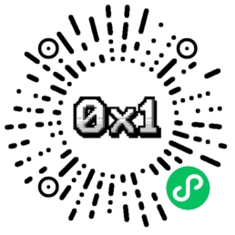

# 🚢 Ship-It-Bounties: 0x1 构筑社区，一个去中心化 AI 产品孵化实验

> **Code in, Product out.**
> 寻找第 101 位“超级个体”构建者。

---

## 👋 关于0x1 构筑社区 (About Us)

我们不是一家传统的外包公司，也不是画饼的创业团队。
我们是一个**盈利稳定（月入 10W+）、现金流健康**的独立开发组织。

目前，我们积压了 30+ 个经过市场前景看好的 AI 落地想法（涉及母婴、图像处理、SaaS 等领域），但受限于开发人力，无法全部落地。

与其把这些机会交给冷冰冰的外包公司，我们决定开源我们的需求池，寻找**有代码洁癖、有产品思维的全栈工程师**，以**“赏金猎人”**的模式共同构建产品。

### 核心理念
*   **No PPT, Just MVP:** 拒绝无意义的文档和会议，代码是唯一的交流语言。
*   **交付即结算:** 任务通过审核（Review），现金赏金立结。
*   **从合作到合伙:** 优秀的构建者将解锁“贡献值”，获得未来产品的分红权与期权。

---

## 🛠 协作模式 (How it Works)

我们需要你通过我们的专属协作工具 —— **微信小程序 [0x1 构筑]** 来领取任务和提交代码。

1.  **领取任务 (Bounty Hunter):** 在小程序中浏览 `Open` 状态的任务。
2.  **提交交付 (Commit):** 上传代码/截图/Demo，提交审核。
3.  **审核与结算 (Review & Pay):** 管理员 Review 通过后，自动增加账户余额，随时提现。

| 等级 | 身份 | 权益 |
| :--- | :--- | :--- |
| **Lv.1** | **探索者** | 现金结算 |
| **Lv.2** | **项目 Owner** | 现金 + 项目分红 (20%-30%) + 核心群 |
| **Lv.3** | **合伙人** | 公司股权 + 年度分红 |

---

## 🎯 当前悬赏任务 (Active Bounties)

> *实时状态请以小程序内为准。以下为部分高优先级任务快照：*

| 任务 ID | 任务名称 | 技术栈 | 赏金 (Money) | 贡献值 (Points) | 状态 |
| :--- | :--- | :--- | :--- | :--- | :--- |
| **T-001** | **自然流视频批量自动化工具** | Python, FFmpeg | **¥1,000** | 3000 | 🔥 Open |
| **T-002** | **四维彩超 AI 还原接口** | ComfyUI, API | **¥2,500** | 6000 | 🔥 Open |
| **T-003** | **八字合婚裂变 H5 (纯前端)** | Vue3, Canvas | **¥600** | 2000 | 🟢 Open |
| **T-004** | **老照片修复分销小程序** | Uni-app, WX Cloud | **¥1,000** | 2500 | 🟢 Open |
| **T-005** | **Agent 陪伴系统逻辑重构** | LLM, Prompt Engineering | **¥1,500** | 3500 | 🟡 Pending |

---

## 💻 技术栈偏好 (Tech Stack)

如果你熟悉以下技术，你就是我们要找的人：

*   **Frontend:** WeChat Mini Program, Uni-app, Vue3, Tailwind CSS
*   **Backend:** WeChat Cloud Development (Node.js), Python (FastAPI)
*   **AI/Model:** Stable Diffusion (ComfyUI), Midjourney API, GPT-4/Claude Prompting
*   **Growth:** SEO, H5 Viral Marketing

---

## 🚀 如何开始 (Getting Started)

我们所有的协作流程都已数字化。请勿直接在此 Repo 提 Issue。

**请直接进入“Ship It”小程序接单：**

1.  打开微信，搜索小程序 **「Ship It」** (或扫描下方二维码)。
2.  进入**“任务大厅”**查看详细需求与验收标准。
3.  点击**“立即交付”**提交你的 Demo 或 GitHub 链接。

*(此处建议放置你的小程序码图片，文件名设为 qr.jpg)*

---

## ❓ FAQ

**Q: 这是一个开源项目吗？**
A: 本 Repo 用于发布需求。具体的任务代码版权归属，详见小程序内的任务协议。Lv.1 任务通常为买断制，Lv.2 以上为共创制。

**Q: 结算周期是多久？**
A: 验收通过（Pass）后，资金即刻计入小程序账户，支持微信/支付宝结算。

**Q: 我是新手可以参与吗？**
A: 我们更看重**交付结果**。如果你能用 AI 工具（如 Cursor/v0）快速产出高质量代码，我们非常欢迎。

---

> **Ship It Team**
> *Building the future, one MVP at a time.*
